## deep Learning basic 

### 神经网络

1. 感知机（Perceptron）
由 Frank Rosenblatt 1975年提出，结构与 MLP 类似，一半被视为最简单的神经网络，作为**二元线性分类器**广泛使用. 通常情况下，指的是单层得人工神经网络。
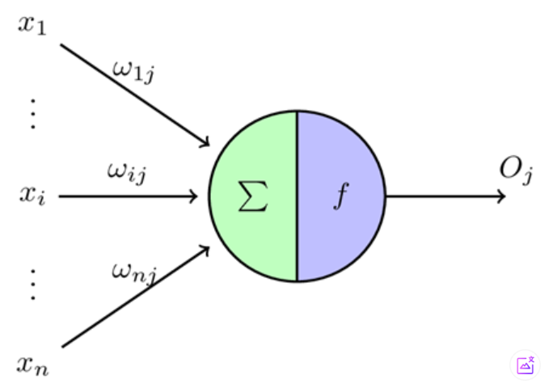
假设有 n 维输入的单层感知机，`x_1` 到 `x_n` 为 n 维输入向量的各个分量，`w_ij` 到 `w_nj` 为各个输入分量连接到感知机的权量（权值），`theta` 为阈值，`f` 为激活函数（又称 激励函数或传递函数），`O` 为标量输出。感知机的输出是输入 `x` 与权重向量 `w` 的内积，经过激活函数 `f` 所得到的标量。

    **应用**：单层感知机类似逻辑回归模型，可以做线性分类任务，但不能做更复杂的任务。

2. 多层感知机（MLP）
1986年McClelland 和 Hinton 正式在MLP中使用BP，并采用Sigmoid 进行线性映射，有效解决非线性分类和学习问题。
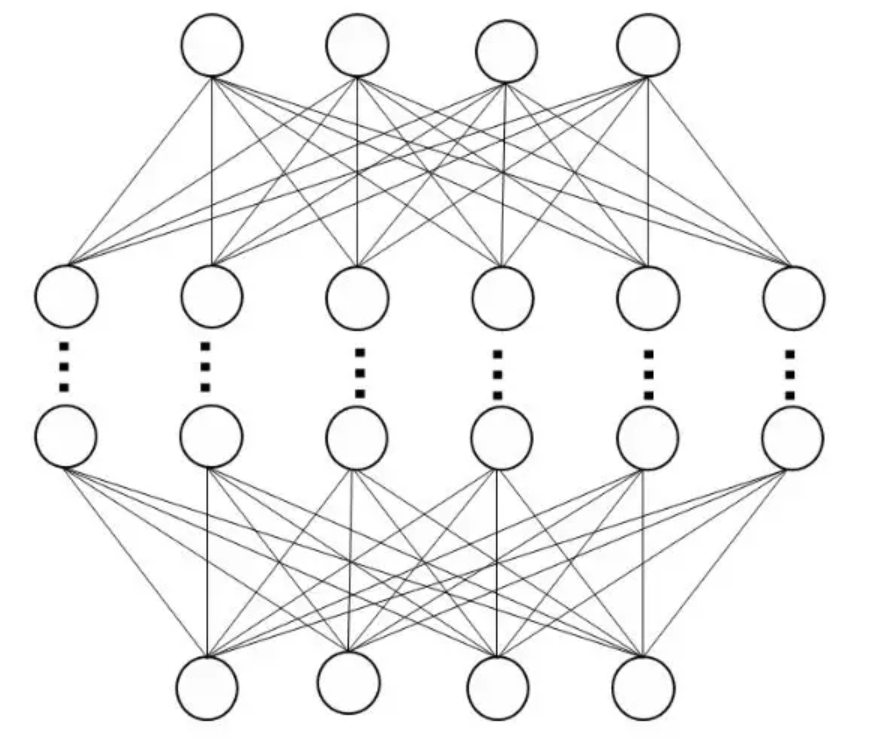
多层感知机（Multi-Layer Perceptron）由单层感知机推广而来，主要的特点是多个神经元层，一般将MLP的第一层称为输入层，中间层称为隐藏层，最后一层称为输出层。MLP没有规定隐藏层的数量，可以根据实际的任务需求设置不同的层数以及每层的神经元个数。

3. 反向传播
MLP的关键在于如何训练其中各层间的连接权值 --> 反向传播（Back Propagation, BP）.
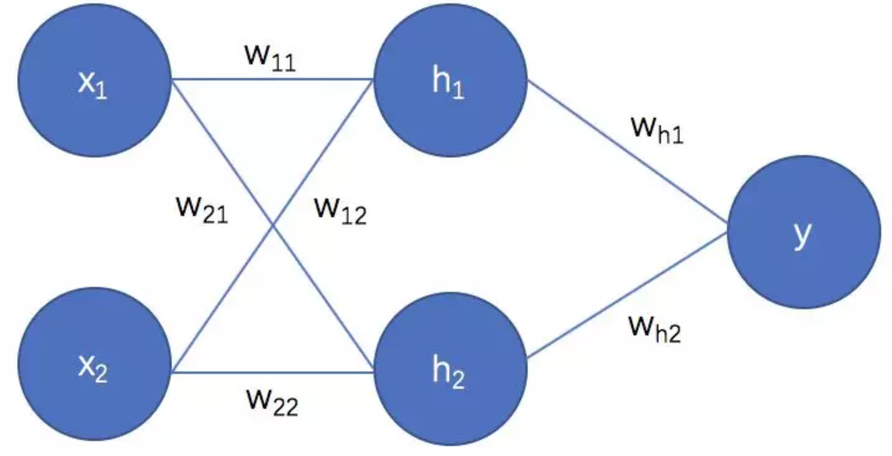
输出为 `y`，损失函数为 `E`:
$$
y = h_1w_{h1} + h_2w_{h2} = x_1w_{11} + x1w_{12} + x_2w_{21} + x2w_{22}
E = 1/2(y - t)^2
$$
假设某一时刻值为：
$$
    x_1=1, x_2=-1, w_{11}=0.1, w_{21}=-0.1, w_{12}=-0.1, w_{22}=0.1, w_{h1}=0.8, w_{h2}=0.9, t=0
    h_1 = x1w_{11} + x_2w_{12} = 1*0.1 + (-1)*(-0.1) = 0.2
    h_2 = x1w_{21} + x_2w_{22} = 1*(-0.1) + (-1)*0.1 = -0.2
    y = h_1w_{h1} + h_2w_{h2} = 0.2*0.8 + (-0.2)*0.9 = -0.02
$$
可以计算E 对W_{h1}的误差传播值为：
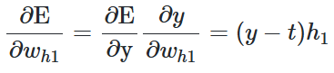
下次更新W_{h1}参数时，采用
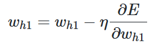
其中，`η` 就是学习率，再继续一层一层推导

## convolutional Neural Network (CNN)

80年代后的20年间它不是主流, LeNet5，1999年由深度学习三巨头中LeCun， Bengi的提出，成功用于银行支票上的手写数字识别，最重要的两个概念（**局部连接+池化**）
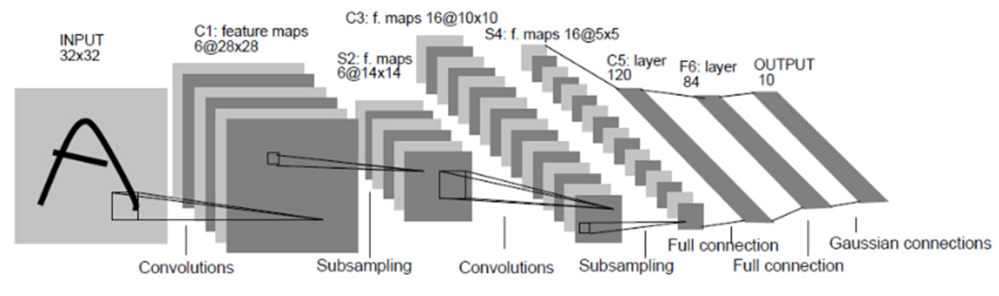

CNN 主要包含卷积层、池化层和全连接层

- 卷积层：用于对图像进行特征提取操作，其卷积核权重是共享权值的，对应的相关概念还包括步长，填充。
- 池化层：用于降低特征图大小，降低后续操作的计算量和参数量
- 全连接层：最终进行分类输出使用，本质就是多层感知机

### 卷积
数字图像领域，卷积操作指的是图像领域的二维卷积
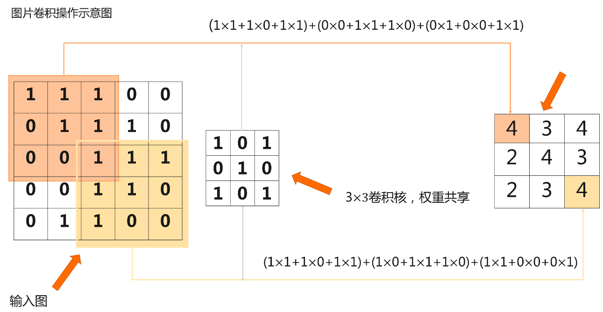
一个二维卷积的案例如上，在图像上滑动，取与卷积核大小相等的区域，逐像素做乘法然后相加。 例如原始图像大小是5×5，卷积核大小是3×3。首先卷积核与原始图像左上角3×3对应位置的元素相乘求和，得到的数值作为结果矩阵第一行第一列的元素值，然后卷积核向右移动一个单位（即步长stride为1)，与原始图像前三行第2、3、4列所对应位置的元素分别相乘并求和，得到的数值作为结果矩阵第一行第二列的元素值，以此类推。

故卷积就是：一个核矩阵在一个原始矩阵上从上往下、从左往右扫描，每次扫描都得到一个结果，将所有结果组合到一起得到一个新的结果矩阵。 注意这里我们不区分卷积和互相关，它们的区别只在于权重算子是否进行了翻转。之所以不重视，是因为在机器学习中，卷积核是否翻转，并不影响算法学习。

```python
    import torch
    import torch.nn as nn

    def conv2d(X, K):  # 输入X, 卷积核K
        h, w = K.shape  # 获取卷积核大小
        Y = torch.zeros((X.shape[0] - h + 1, X.shape[1] - w + 1))  # 初始化结果矩阵
        for i in range(Y.shape[0]):  # 遍历结果矩阵的行
            for j in range(Y.shape[1]):  # 遍历结果矩阵的列
                Y[i, j] = (X[i:i + h, j:j + w] * K).sum()  # 计算卷积
        return Y
```
简单模拟
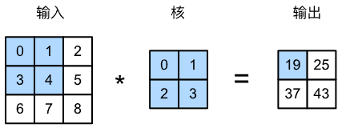

### 填充
> 1. 使卷积后图像分辨率不变，方便计算特征图尺寸的变化
> 2. 弥补边界信息的损失

填充（padding）是指在输入高和宽的两侧填充元素（通常是0元素）。下图我们在原输入高和宽的两侧分别添加了值为0的元素，使得输入高和宽从3变成了5，并导致输出高和宽由2增加到4。下图阴影部分为第一个输出元素及其计算所使用的输入和核数组元素：0×0+0×1+0×2+0×3=0。
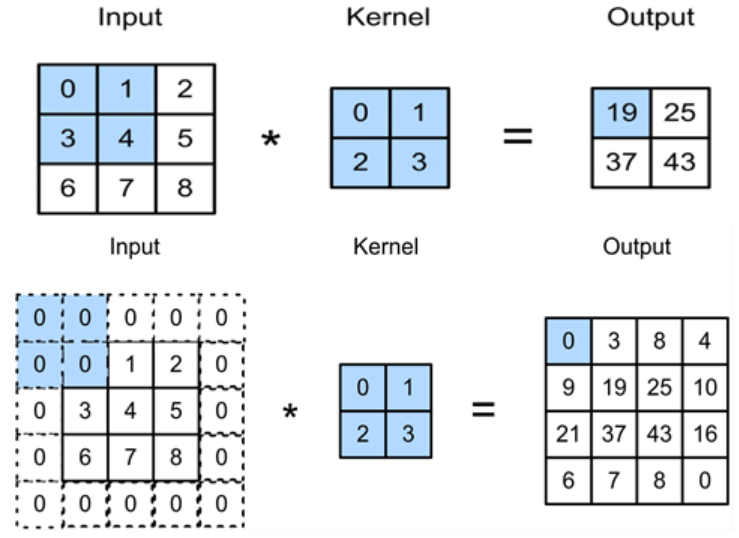

### 步长
卷积窗口从输入数组的最左上方开始，按从左往右、从上往下的顺序，依次在输入数组上滑动。我们将每次滑动的行数和列数称为步幅或步长（stride）。

下图展示了在高上步幅为3、在宽上步幅为2的卷积运算。可以看到，输出第一列第二个元素时，卷积窗口向下滑动了3行，而在输出第一行第二个元素时卷积窗口向右滑动了2列。当卷积窗口在输入上再向右滑动2列时，由于输入元素无法填满窗口，无结果输出。下图阴影部分为输出元素及其计算所使用的输入和核数组元素：0×0+0×1+1×2+2×3=8、0×0+6×1+0×2+0×3=6。

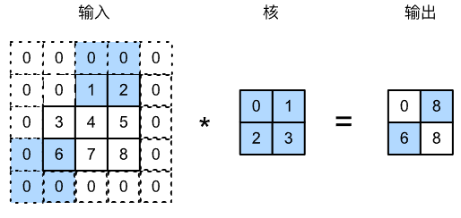

### 池化
对图像进行下采样，降低图像的分辨率，作用：**1.使特征图变小，简化网络计算复杂度；2.压缩特征，提取主要特征**
常见的池化操作可以分为：最大池化（Max Pool）、平均池化（Avg Pool），示意图如下：
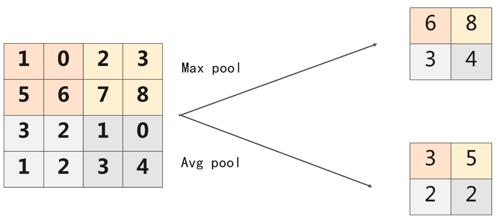

### 卷积和池化输出尺寸计算
假设输入图片的高和宽一致，卷积核的宽和高一致，那么输入图像的尺寸与输出图像的尺寸有如下关系：其中，`F_{in}`是输入图像、`k` 是卷积核的大小、`p` 是图像填充的大小、`s` 是卷积核的步幅、 `F_o` 是输出、`⌊6.6⌋` 是向下取整的意思，比如结果是 6.6，那么向下取整就是 6
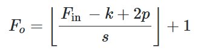
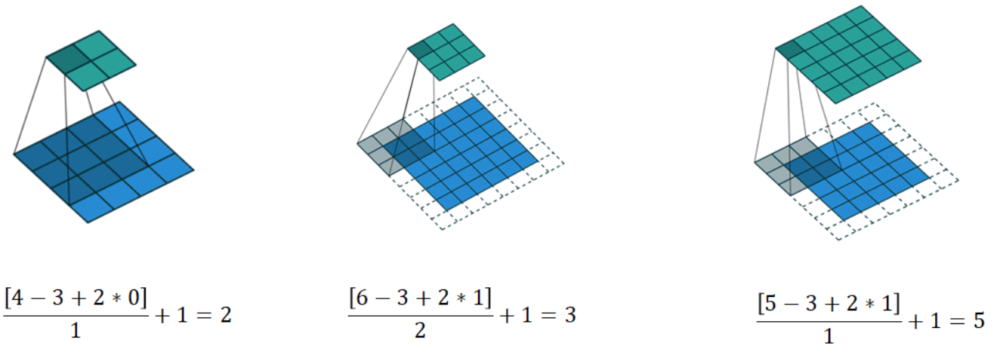

